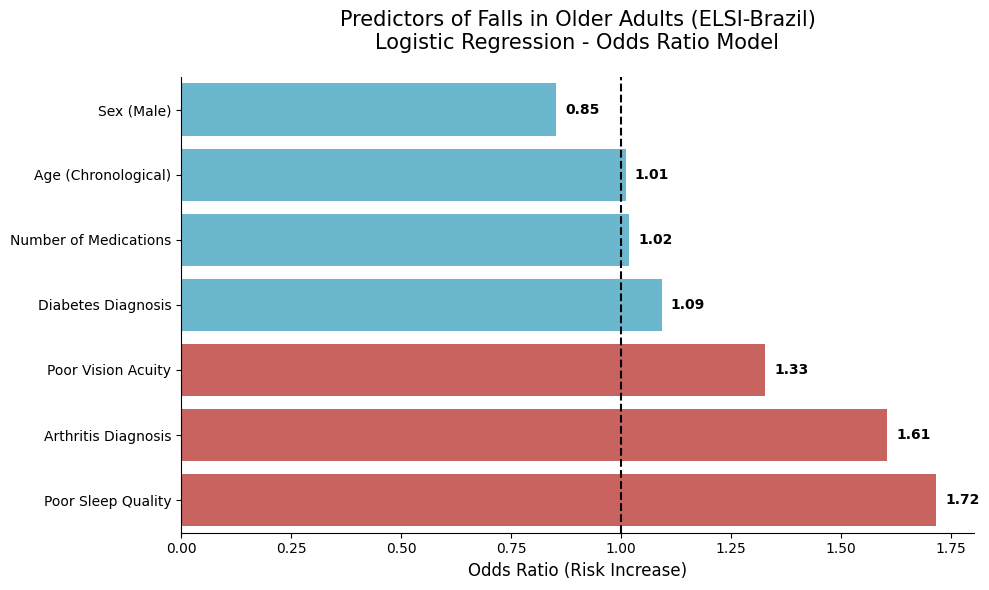

# 🏥 Predicting Fall Risk in Older Adults (ELSI-Brazil Dataset)

This project was developed as part of my transition from **Medicine** to **Digital Science**. It leverages machine learning to identify high-risk patients for falls using real-world data from the **ELSI-Brazil (English Longitudinal Study of Ageing)**, a nationally representative study of Brazilians aged 50 and older.

## 📝 Project Overview
Falls are a major public health challenge in geriatrics, leading to loss of independence and high healthcare costs. This project applies **Predictive Analytics** to clinical and socioeconomic variables to provide a data-driven tool for fall prevention and clinical decision support.

## 🚀 Key Clinical Insights (Odds Ratio)
The model identified that functional and clinical factors often outweigh chronological age as predictors:
* **Sleep Quality (OR: 1.72):** Poor or non-restorative sleep increased the risk of falling by 72%.
* **Arthritis (OR: 1.61):** A clinical diagnosis of arthritis is a significant predictor of mechanical falls.
* **Visual Acuity (OR: 1.33):** Difficulties in vision, even with corrective lenses, remain a critical risk factor.

## 🧪 Clinical Scenarios & Patient Simulations
To demonstrate the tool's practical application in a geriatric ward or primary care setting, I conducted four test simulations based on common clinical profiles:

| Patient | Profile Summary | Estimated Risk | Clinical Recommendation |
| :--- | :--- | :--- | :--- |
| **A** | 69yo, Female, Sleep issues, 5+ meds | **57.5%** | Moderate Risk: Environmental monitoring. |
| **B** | 74yo, Female, Diabetes, Sleep issues | **61.0%** | **High Risk**: Immediate intervention (PT/Sleep review). |
| **C** | 66yo, Male, Visual impairment, Diabetes | **48.6%** | Moderate Risk: Vision and environmental check. |
| **D** | 85yo, Male, Arthritis, 7+ meds, Sleep issues | **69.6%** | **High Risk**: Physical therapy & medication review. |

## 🛠️ Data Science & Technical Stack
- **Language:** Python
- **Core Libraries:** `Pandas` for data wrangling, `Scikit-Learn` for modeling, and `Seaborn/Matplotlib` for medical data visualization.
- **Handling Imbalanced Data:** Employed `class_weight='balanced'` within a Logistic Regression framework to address the rarity of fall events, successfully increasing the model's **Recall** from 0.01 to **0.58**.
- **Clinical Feature Engineering:** Transformed raw health surveys into a structured matrix for predictive modeling.

## 📊 Data Source: 
This study uses data from the ELSI-Brazil, which is supported by the Brazilian Ministry of Health and the Ministry of Science, Technology, and Innovation. Citation: Lima-Costa MF, et al. The Brazilian Longitudinal Study of Aging (ELSI-Brazil): Objectives and Design. Am J Epidemiol. 2018.

---
**Academic Goal:** This portfolio serves as a technical demonstration of my skills for Master's applications in *Digital Science*, *Health Data Analytics*, or *Medical Informatics* in Italy.

